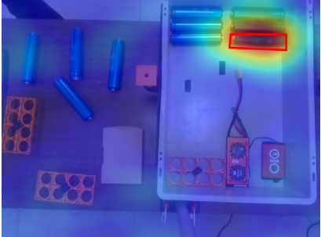
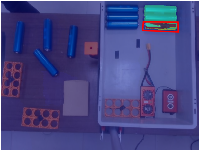
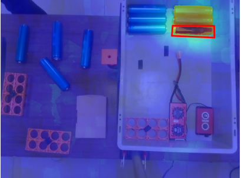

# D-CRISP: Explaining Object Detectors by Combining Randomized and Segment-based Perturbations

Official repository for **D-CRISP**, accepted at the [28th European Conference on Artificial Intelligence (ECAI 2025)](https://ecai2025.org/).  

📄 **Paper**: [link coming soon]  


<div align="center">

  <figure style="display:inline-block; text-align:center; margin:10px;">
    <figcaption>D-RISE</figcaption>
    
  </figure>

  <figure style="display:inline-block; text-align:center; margin:10px;">
    <figcaption>D-MFPP</figcaption>
    
  </figure>

  <figure style="display:inline-block; text-align:center; margin:10px;">
    <figcaption>D-CLOSE</figcaption>
    
  </figure>

  <figure style="display:inline-block; text-align:center; margin:10px;">
    <figcaption>D-CRISP</figcaption>
    
  </figure>

  <em>Comparison of saliency maps generated by D-RISE, D-MFPP, and D-CRISP on the sample image (N=1000, p1=0.25). 
  Jupyter notebooks are included in the repository for exploration.</em>

</div>

This codebase extends this [repository](https://github.com/aklein1995/drise_dmfpp_ddeletion), where *D-MFPP* was proposed.

## Example of usage

```bash
python3 -m scripts.drise_dmfpp_dcrisp  \
    --datadir use_case/ \
    --labels_dir use_case/ \
    --model_path use_case/models/best.pt \
    --saliency_map_dir saliency_maps/ \
    --height 736  --width 1280 \
    --N 500 --p1 0.25 --resolution 16 --gpu_batch 50 \
    --mask_type crisp
```

Then, extract metrics with:

```bash
python3 -m scripts.multiple_metrics  \
    --datadir use_case/ \
    --labels_dir use_case/ \
    --model_path use_case/models/best.pt \
    --saliency_map_dir saliency_maps/ \
    --height 736  --width 1280 \
    --csv_dir "results/metrics.csv" --num_classes 8
```

## Jupyter Notebooks
In addition to the command-line scripts, we provide Jupyter notebooks for running and visualizing results with D-RISE, D-MFPP, and D-CRISP.

These notebooks demonstrate usage on the provided sample image and can be adapted to custom datasets.

## Citation:
```bibtex
@inproceedings{andres2025dcrisp,
  title     = {D-CRISP: Explaining Object Detectors by Combining Randomized and Segment-based Perturbations},
  author    = {Andres, Alain and Del Ser, Javier},
  booktitle = {European Conference on Artificial Intelligence (ECAI)},
  year      = {2025}
}